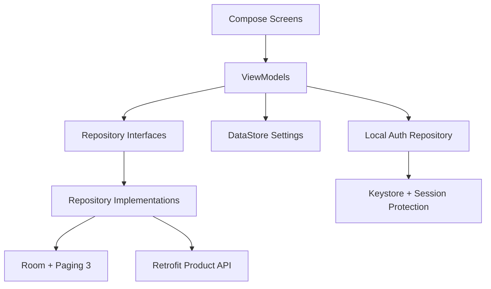

# StoreFront

StoreFront is an Android Kotlin take-home assignment focused on modern Android architecture, offline-first product browsing, secure local authentication, and maintainable Jetpack Compose UI.

Repository: [https://github.com/dikascode-playground/store_front_.git](https://github.com/dikascode-playground/store_front_.git)

The app supports:
- username/password sign in
- local sign up
- biometric re-entry
- persistent local session
- paginated products from `https://dummyjson.com/products`
- search, sorting, and category filtering
- offline caching with Room + Paging 3
- favorites with undo remove
- local add/edit/delete product flows
- reset local changes from API
- theme switching and English/Hebrew localization

## Setup

### Requirements
- Android Studio with current Kotlin/Compose support
- Android SDK 36
- JDK 11

### Run locally
1. Open the project in Android Studio.
2. Let Gradle sync complete.
3. Run the `app` configuration on an emulator or device.

### Useful Gradle commands
```bash
./gradlew :app:compileDebugKotlin
./gradlew test
./gradlew lint
./gradlew assembleDebug
```

## Testing Credentials

Seeded review account:

- Username: `ibi_engineer`
- Password: `Android@123`

You can also create additional local accounts from the sign-in screen.

## Feature Coverage

### Authentication
- Username/password login
- Local sign-up flow
- Input validation and loading states
- Persistent local session
- Biometric re-entry flow
- Lottie animation on favorites empty state

### Products
- Fetches products from `https://dummyjson.com/products`
- Displays paginated list with Paging 3
- Product details screen
- Search by title/description
- Sorting
- Category filtering
- Offline caching support
- Coil-powered remote product imagery

### Favorites
- Add/remove favorites
- Favorites persisted locally
- Undo remove action via Snackbar

### Settings
- Dark/light mode
- Language switching between English and Hebrew
- Logout

### CRUD
- Add local products
- Edit local/remote-backed cached products locally
- Delete products locally
- Reset local changes from API

## Architecture

The app is implemented as a single-module MVVM application with clear separation between UI, state, repositories, persistence, networking, and security.



### Structure
- `app/navigation`
  - navigation graph and top-level screen composition
- `feature/*`
  - screen-specific ViewModels for auth, products, favorites, details, editor, and settings
- `core/model`
  - domain models and repository contracts
- `core/database`
  - Room entities, DAOs, database module
- `core/network`
  - Retrofit API + DI
- `core/datastore`
  - DataStore-backed session/settings persistence
- `core/security`
  - password hashing and session protection
- `data/*`
  - repository implementations and mediator logic

### State management
- UI state is exposed from ViewModels using `StateFlow`
- async work uses coroutines
- product pagination uses `Flow<PagingData<Product>>`
- settings/auth state are observable and drive navigation and UI behavior

## Offline-First Strategy

The product flow is built around Room as the local source of truth.

- remote products are fetched through Retrofit
- `ProductRemoteMediator` coordinates paged network fetches into Room
- screens render from the local database, not directly from the network
- search, sort, filter, favorites, and details operate from cached local data
- local CRUD marks product state locally without requiring a backend write path
- reset local changes rehydrates remote-backed products from the API and removes local-only created rows

This keeps the browsing experience available even after network loss once data has been cached.

## Security Decisions

### Password handling
- passwords are not stored in plaintext
- local accounts store salted password hashes
- hashing uses `PBKDF2WithHmacSHA256`

### Session handling
- successful login creates a local session
- raw passwords are not persisted for biometric support
- session material is protected through the Android Keystore-backed session protection layer

### Biometrics
- biometrics are used for session re-entry, not password recovery
- biometric unlock is tied to an authenticated crypto path rather than only a UI boolean lock

## UI/UX Notes

The assignment prioritized code quality over pixel-perfect design, but the UI was deliberately refined beyond default Compose scaffolding:

- custom blue light/dark theme
- more structured auth flow
- stronger product list hierarchy
- grouped settings sections
- real product imagery
- clear favorite state feedback
- secondary tools demoted below primary browsing actions

## Testing Strategy

The project focuses on high-signal unit and repository testing around the logic most likely to regress.

Current test coverage includes:
- `LoginViewModelTest`
- `SignUpViewModelTest`
- `ProductEditorViewModelTest`
- `ProductsViewModelTest`
- `PreferenceStorageTest`
- `LocalAccountAuthRepositoryTest`
- `OfflineFirstProductRepositoryTest`

The tests cover:
- auth validation and duplicate-submit protection
- sign-up/login behavior
- session and biometric storage transitions
- product editor validation
- sort/search/filter state behavior
- reset-local-changes repository correctness

## Verification

The app was verified with:

```bash
./gradlew :app:compileDebugKotlin
./gradlew test
./gradlew lint
./gradlew assembleDebug
```

In addition to Gradle verification, key flows were reviewed manually during implementation:
- sign in / sign up
- biometric enable/unlock
- favorites add/remove
- product details/editor navigation
- theme and language switching

## Trade-offs

- The project stays single-module to keep the take-home scope practical and readable.
- Authentication is local-device scoped rather than backend-backed, because the assignment does not provide a real auth service.
- Local CRUD is intentionally modeled as offline/local change management rather than pretending to persist remote writes to the dummy API.
- The test suite emphasizes ViewModel, storage, and repository correctness over a larger instrumentation/UI suite.

## How I Would Evolve This for Production

- split the codebase into feature/data/core Gradle modules
- add remote auth/token refresh and secure account recovery
- add richer UI instrumentation tests
- add analytics and crash reporting
- add stronger image loading placeholders and prefetching
- add more structured offline sync conflict policies

## AI Usage Report

### AI tools used
- OpenAI Codex

### What AI assisted with
- Helped draft initial repository and ViewModel scaffolding for the authentication and product flows
- Helped iterate on Compose layout changes for the sign-in, products, details, and settings screens
- Helped generate initial unit-test scaffolding for auth, product, and storage-related tests
- Helped identify missing assignment coverage and review gaps, including filtering, Coil image usage, Lottie, favorites undo, and weaknesses in the first reset-local-changes implementation
- Helped refine the README and AI usage documentation

### What was implemented or reviewed manually
- I made the final decisions on architecture, feature scope, and trade-offs
- I manually reviewed the authentication and biometric session flows because they were the highest-risk security areas in the assignment
- I manually reviewed the offline-first reset behavior and corrected cases where the earlier implementation was not strong enough for the take-home requirements
- I manually validated the finished app against the assignment requirements and used that review to close the remaining gaps around filtering, Coil image usage, Lottie, and favorites undo
- I reviewed AI-generated suggestions against compile results, test results, and runtime behavior instead of accepting them at face value

### Meaningful prompts used during development
1. `Review the current local authentication and biometric session design. Identify security weaknesses, race conditions, and places where session restoration is too trusting. Recommend the smallest set of changes needed to make it robust without overengineering it.`
2. `Review the offline-first product flow end to end. Focus on Room, RemoteMediator, reset-local-changes behavior, and favorites persistence. Identify where the implementation is not truly restoring authoritative remote state.`
3. `Compare the current implementation against the take-home requirements and identify the remaining functional gaps only. Separate must-have requirement gaps from optional polish.`
4. `Review the current Compose screens from a senior Android perspective. Focus on information hierarchy, state feedback, navigation clarity, and whether the UI supports the assignment requirements without unnecessary complexity.`

### How correctness and code quality were verified
- I repeatedly verified the app with `./gradlew :app:compileDebugKotlin`, `./gradlew test`, `./gradlew lint`, and `./gradlew assembleDebug`
- I added and ran unit and repository-level tests for authentication, session storage, product editing, product list state, and offline reset behavior
- I used verification results to fix concrete issues, including duplicate-submit races in auth ViewModels, weak biometric session behavior, partial reset-local-changes restoration, and test fakes that drifted after interface changes
- I also manually reviewed the major user flows, including sign-in, sign-up, biometric unlock, favorites, filtering, CRUD, theme switching, and localization
